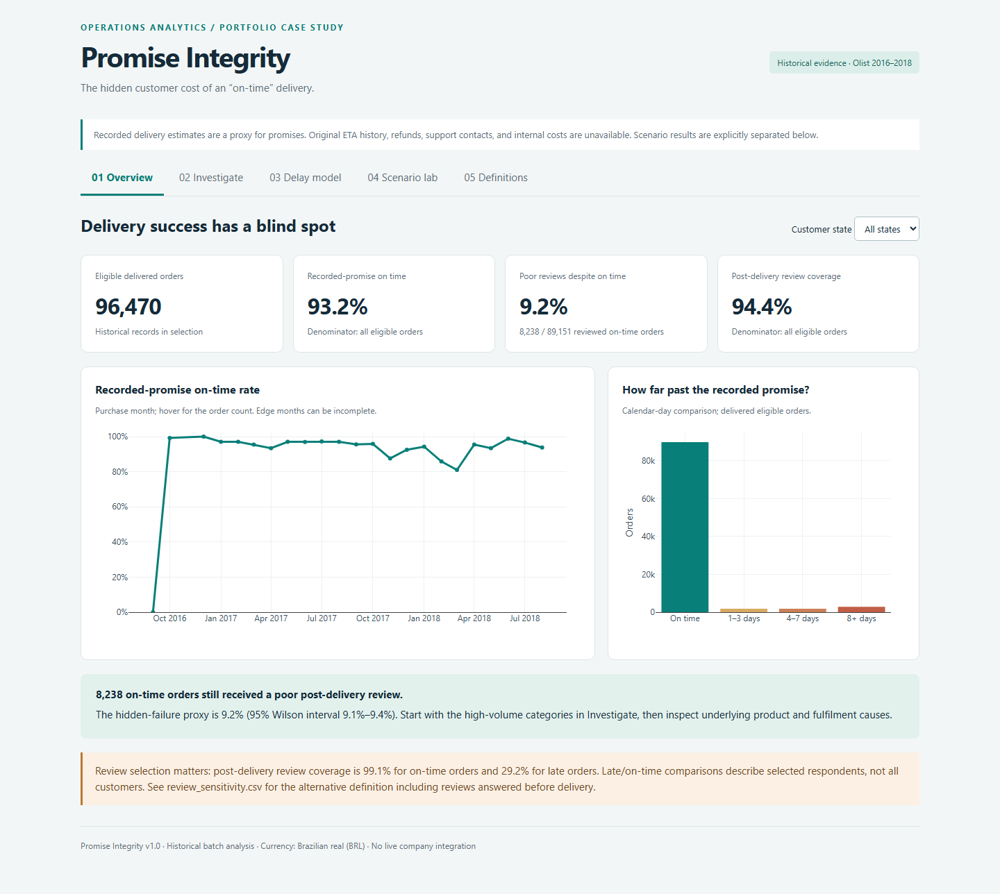
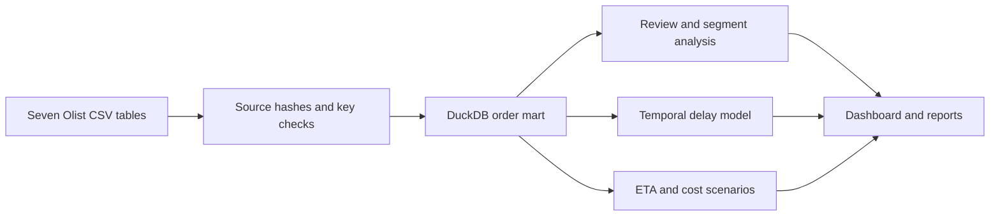

# Promise Integrity

### Customer dissatisfaction hidden behind on-time delivery metrics

A delivery can arrive on time and still disappoint the customer. Promise Integrity examines this gap using Olist's historical e-commerce data, combining a validated SQL order mart, statistical analysis, a retrospective delay model, and an interactive dashboard.

**Python · SQL · DuckDB · pandas · SciPy · scikit-learn · Plotly · Excel**

[Project report](docs/PROJECT_REPORT.md) · [PDF report](reports/Project_Report.pdf) · [Analysis notebook](notebooks/01_analysis_walkthrough.ipynb) · [Data dictionary](docs/DATA_DICTIONARY.md)



## The business question

**Which orders meet the recorded delivery deadline but still receive poor customer reviews?**

An on-time delivery rate measures one part of the customer experience. This project adds a second view: poor post-delivery reviews among orders that arrived on time. It investigates affected segments, checks whether review timing distorts comparisons, and separates measured outcomes from hypothetical business scenarios.

The analysis supports investigation priorities for operations and customer-experience teams. It does not establish why a customer was dissatisfied or claim that an intervention produced savings.

## Key findings

Results below come from the supplied historical dataset run.

| Measure | Result | Interpretation |
| --- | ---: | --- |
| Source orders | 99,441 | Before delivered-order eligibility filters |
| Eligible delivered orders | 96,470 | Population used for the on-time metric |
| On-time delivery rate | 93.23% | 89,936 orders arrived by the recorded estimate date |
| On-time orders with poor post-delivery reviews | 8,238 | Selected review score of 1 or 2, answered at or after delivery |
| Poor-review rate among reviewed on-time orders | 9.24% | 8,238 / 89,151; Wilson 95% interval: 9.05%–9.43% |
| Delay model, held-out ROC AUC | 0.828 | Chronological test set; average precision: 0.302 |

**A key finding about the data:** post-delivery review coverage is 99.13% for on-time orders but only 29.16% for late orders. Comparisons therefore describe selected reviewer populations, not all customers.

**A metric-design finding:** extending every recorded deadline by seven days reclassifies 3,672 orders as on time without changing any actual delivery date. This is a sensitivity scenario, not evidence of a practice used by Olist.

Exact counts and model metrics are available in [summary.json](reports/summary.json); validation diagnostics are in [quality.json](reports/quality.json).

## Explore the results

- **Interactive dashboard:** choose **Code → Download ZIP**, extract the repository, and open `reports/dashboard.html` in a browser. Keep `plotly.min.js` beside it. Charts work offline; GitHub's HTML file viewer displays source rather than a running dashboard.
- **Case study:** read the [Markdown report](docs/PROJECT_REPORT.md) or download the [PDF](reports/Project_Report.pdf).
- **Analysis:** follow the executed [notebook](notebooks/01_analysis_walkthrough.ipynb) and inspect the SQL and Python source.
- **Reconciliation:** download the [Excel workbook](reports/Metric_Reconciliation.xlsx) to inspect formulas, monthly metrics, and the chart.

## Analytical approach



1. **Acquire and validate.** Download the source tables, record SHA-256 hashes, and check keys, chronology, missingness, and row counts.
2. **Preserve the order grain.** Aggregate items and select the earliest answered review before joining. Reconcile merchandise totals so one-to-many joins cannot multiply order values.
3. **Define comparable metrics.** Filter eligible delivered orders and distinguish on-time delivery, qualifying post-delivery reviews, and poor-review rates. Keep denominators explicit.
4. **Investigate variation and uncertainty.** Analyse segments with Wilson intervals, a purchase-week cluster bootstrap, and customer-state standardization. Check review timing before interpreting differences.
5. **Evaluate delay risk.** Use handoff-time features, chronological train/validation/test windows, and preprocessing fitted on training data. Select the alert threshold on validation data using explicit error-cost assumptions.
6. **Stress-test decisions.** Explore deadline extensions and assumed recovery costs separately from observed findings. Present investigation priorities and a proposed experiment in the report.

At the selected model threshold, test precision is **12.08%** and recall is **47.78%**. The false-alert burden matters; ROC AUC alone does not establish operational value.

## Dataset

Source: [Brazilian E-Commerce Public Dataset by Olist](https://www.kaggle.com/datasets/olistbr/brazilian-ecommerce), covering historical records from **2016–2018**.

The pipeline uses orders, order items, reviews, customers, products, sellers, and product-category translations. See the [data dictionary](docs/DATA_DICTIONARY.md) for derived fields and the [source manifest](reports/data_manifest.json) for file hashes.

Raw CSVs, the local database, and row-level exports are excluded from Git. The pipeline regenerates them. Aggregate outputs and the prebuilt dashboard/report/workbook are included for inspection.

## Quick start

Use **Python 3.11 or 3.12**. Extract or clone the repository and open a terminal in its root folder. Initial package and dataset downloads require internet access.

### Windows PowerShell

```powershell
py -3.12 -m venv .venv
.venv\Scripts\python.exe -m pip install -e ".[dev,docs]"
.venv\Scripts\python.exe scripts/download_data.py
.venv\Scripts\python.exe -m promise_integrity.pipeline
.venv\Scripts\python.exe -m pytest -q
```

### macOS / Linux

```bash
python3 -m venv .venv
.venv/bin/python -m pip install -e ".[dev,docs]"
.venv/bin/python scripts/download_data.py
.venv/bin/python -m promise_integrity.pipeline
.venv/bin/python -m pytest -q
```

Open `reports/dashboard.html` after the pipeline completes. It also writes analytical outputs to `reports/` and local data artifacts under `data/`.

To run the optional local scale benchmark and rebuild the PDF/Markdown report on Windows:

```powershell
.venv\Scripts\python.exe scripts/benchmark.py
.venv\Scripts\python.exe scripts/build_report.py
```

On macOS/Linux, use `.venv/bin/python` for the same scripts. The benchmark replays existing records to test computation; its 1.93 million rows are not additional independent orders. The supplied Excel workbook and executed notebook are prebuilt artifacts; the pipeline does not regenerate those two files.

If Kaggle's public download endpoint requires authentication, download the dataset from its source page and place the seven CSVs named in `scripts/download_data.py` in `data/raw/`. [requirements-tested.txt](requirements-tested.txt) records direct package versions from the delivered execution; it is not a complete dependency lockfile.

## Repository structure

```text
promise-integrity/
├── .github/workflows/tests.yml    # Fixture-based CI
├── docs/
│   ├── DATA_DICTIONARY.md         # Fields and metric definitions
│   └── PROJECT_REPORT.md          # Full analytical case study
├── notebooks/                    # Executed analysis walkthrough
├── reports/                      # Aggregate evidence and presentation assets
├── scripts/                      # Download, benchmark, report, optional Spark
├── sql/                          # Order mart and investigation queries
├── src/promise_integrity/         # Pipeline, analytics, model, dashboard
├── tests/                        # Analytical contracts and edge cases
├── pyproject.toml                # Package metadata and dependencies
├── requirements-tested.txt       # Previously tested direct versions
├── DATA_LICENSE.md
├── THIRD_PARTY_NOTICES.md
└── LICENSE
```

The download and pipeline commands create local data files under the ignored `data/` paths.

## Validation

The test suite covers join grain, value reconciliation, review selection, date edge cases, and model feature boundaries. [GitHub Actions](.github/workflows/tests.yml) is configured to run these tests on pushes and pull requests using generated fixtures; it does not download or rerun the full Olist dataset.

The original delivered run recorded **15 passing tests**. A local rerun on **5 October 2026** was blocked during collection by Windows Application Control on a scikit-learn binary; no tests executed in that attempt. A fresh passing run is still pending. Check the repository's Actions results for validation of a published commit.

## Scope and limitations

- The recorded estimate is not verified as the original promise; ETA revision history is unavailable.
- Reviews are satisfaction proxies. A poor score does not establish that delivery caused the problem, and review timing selects different populations.
- Financial scenarios use assumed margins and recovery costs. Refund amounts, internal costs, and realized savings are not observed.
- This is historical batch analysis and retrospective modelling, with an offline dashboard. No live integration or intervention was deployed.
- The optional Spark extension is unexecuted. No native Power BI or Tableau report is included. The Excel workbook includes formulas and a chart, but no embedded Power Query refresh or native PivotTables.
